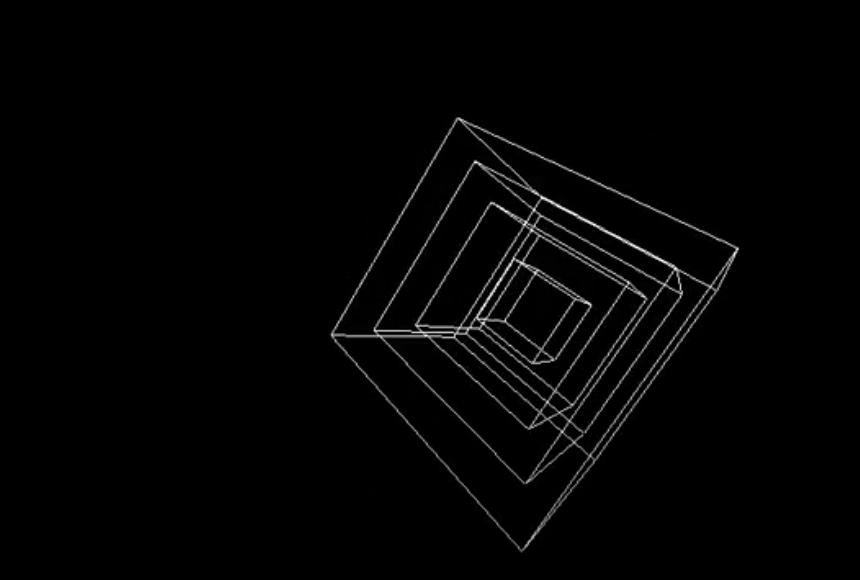
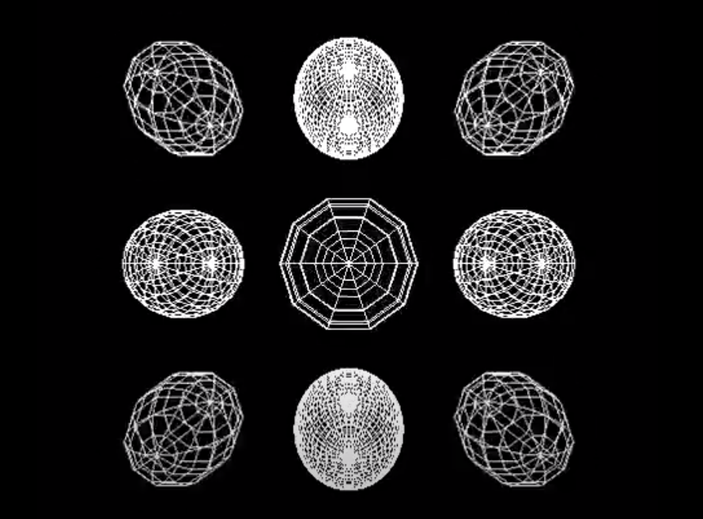

# PureDataPatches

A selection of patches programmed in Pure Data.
Exploring audio/visual interactions and control with an X-Box style gamepad. 

Video Examples:

Gamepad controlled cubes - https://youtu.be/B9SyLtsWsAA

Midi controlled boxes - https://youtu.be/eRzTSCeT7N0

Audio/Visual interactive boxes, with gamepad controls - https://youtu.be/q-aLP4siAFM

Audio/Visual interactions - https://youtu.be/0Dg79_tUBCE
